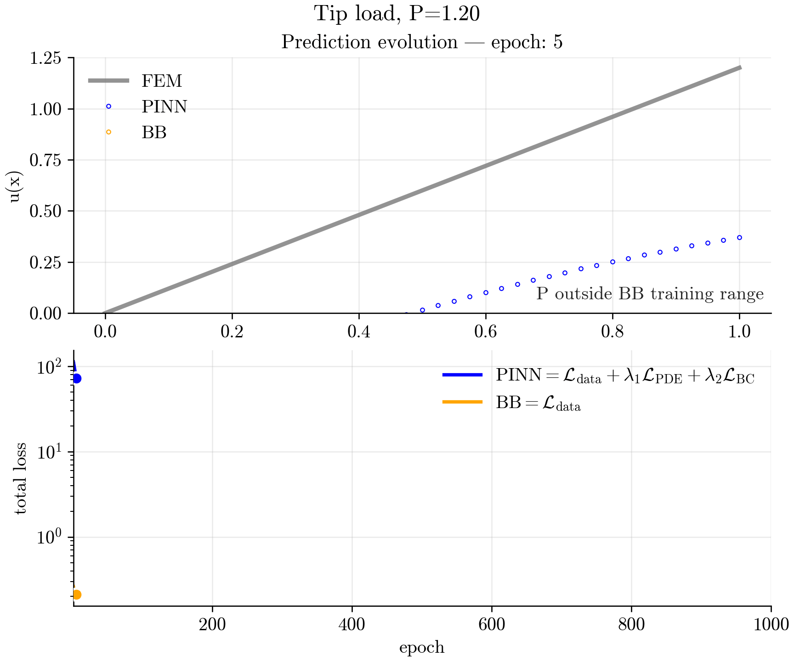

# 🏗️ PINN vs FEM for a 1D Elastic Bar

**Physics-Informed Neural Networks (PINNs) vs a purely data-driven black-box** on a classical solid-mechanics benchmark: the axial displacement of a prismatic bar. The repo provides:
- 🔧 A minimal **FEM reference solver**,
- 🧠 A **PINN** that enforces the PDE and boundary conditions,
- 📊 A **black-box MLP** trained on noisy supervised data,
- 🔬 Reproducible **experiments** (data-efficiency, noise robustness, extrapolation).

## 📐 Problem statement

Consider a straight 1D bar of length $\text(L)$ with axial displacement $u(x)$. Let $E(x)$ be Young's modulus, $A(x)$ cross‑sectional area, and $f(x)$ the axial body force per unit length. The governing equation in strong form is:


$\Large{-\frac{d}{dx}\left(E(x)A(x)\frac{du}{dx}\right) = f(x), \quad x\in(0,L).}$

Supported boundary conditions on $x=0$ and $x=L$:

- 📌 **Dirichlet (displacement)**: $u=u_0$.
- ⚡ **Neumann (traction / tip load)**: $EAu'(x)=P$.
- 🔗 **Robin (spring / convective)**: $EAu'(x)+hu = g$.

> 💡 This project mainly showcases **tip load** and **body force** cases with homogeneous material; heterogeneity and Robin BCs are included in the code and easy to toggle.lastic Bar
---

## 🏆 Selected results

<p align="center">
  
  
  <br/>
  <em></em>
</p>

### 📊 Key Findings:

- ✅ For **interpolation** (in-range), $\text{PINN}$ and $\text{BB}$ achieve low error; $\text{PINN}$ converges in fewer epochs.
- 🚀 For **Extrapolation**, $\text{PINN}$ remains accurate; $\text{BB}$ deteriorates.
- 🛡️ In the case of **noisy data**, $\text{PINN}$ has higher reliability.
- 📈 On a **limited amount of training data** samples, $\text{PINN}$ functions much better than $\text{BB}$.
---


## 📂 Repository layout

    .
    ├── 🎨 assets/
    ├──  banners/                     # hero figures and animations for README
    ├── 📝 examples/                   # YAML configuration files for common scenarios
    │   ├── body_force.yml              # uniform body force case
    │   ├── hetero_robin.yml            # heterogeneous material with Robin BCs
    │   ├── tip_load_inrange.yml        # tip load within training range
    │   └── tip_load_extrapolate.yml    # tip load extrapolation case
    ├── 💻 src/
    │   ├── ⚙️ core/                   # reusable components
    │   │   ├── fem.py
    │   │   ├── pinn.py
    │   │   ├── physics.py
    │   │   └── utils.py
    │   ├── 🚀 training/
    │   │   ├── run_fem.py             # CLI: make FEM CSV for a case/BCs
    │   │   ├── run_pinn.py            # CLI: train PINN & save log
    │   │   └── train_blackbox.py      # CLI: train supervised MLP & save log
    │   ├── 🔬 experiments/
    │   │   ├── data_gen.py            # create noisy datasets for the Black box model
    │   │   └── sweep_metrics.py       # data-efficiency & noise robustness sweeps
    │   └── 📈 visualization/
    │       ├── plot_metrics.py
    │       └── hero_figure.py
    ├── 🧪 tests/
    ├── ⚡ Makefile                    # one-command pipelines
    ├── 🌍 env.yml
    ├── 📦 pyproject.toml              # packaging metadata
    └── 📖 README.md                   # this file

---

## ⚡ Quickstart (60 seconds)
### You can run the provided scenarios in **two ways**:

### 🔹 1. YAML configs (recommended)
Each example is defined in the [`examples/`](examples/) folder as a simple `YAML` file.
This is the most flexible way to run or modify experiments.

```bash
# 0️⃣ Create environment
conda env create -f env.yml
conda activate py310-torch

# 1️⃣ In-range demo (tip load, P=0.60 → FEM + PINN + BB + joint figure)
python -m src.experiments.run_from_config --cfg examples/tip_load_inrange.yaml

# 2️⃣ Extrapolation demo (outside BB training range, P=1.20)
python -m src.experiments.run_from_config --cfg examples/tip_load_extrap.yaml
```

To create a new scenario, simply copy an existing YAML in [`examples/`](examples/) and modify boundary conditions, loads, or training settings.

### 🔹 2. Makefile shortcuts

For users who prefer `make`, a set of quick aliases is still available:

```bash
# 0️⃣ Create env
conda env create -f env.yml
conda activate py310-torch

# 1️⃣ In-range demo (tip load P=0.60) → FEM + PINN + BB + joint figure
make inrange CASE=tip_load P=0.60 EPOCHS=1200 BB_EPOCHS=1200

# 2️⃣ Extrapolation demo (outside BB training range)
make extrap               # alias for P=1.20; adjust in Makefile if desired

# 3️⃣ Generate the hero figure
make hero
  ```

📁 Results appear under `data/outputs/<CASE>_P<P>/`. Example artifacts:
- `fem_tip_load.csv` – reference solution $(x,u)$
- `pinn_tip_load_trainlog.npz` – $\text{PINN}$ losses & snapshots,
- `bb_trainlog.npz` – black-box losses & snapshots,
- `hero.png` / `hero.svg` – composite figure ($\text{FEM}$ vs $\text{PINN}$ vs $\text{BB}$)

## What's implemented
- **FEM reference** with linear 1D bar elements.
- **PINN**:
  - fully connected MLP
  - PDE residual + weighted BC losses
  - optional input/output normalization.
- **Black-box MLP**: supervised $[x, P] \rightarrow u$, integrated no pysics.
- **Experiments**:
  - *Data efficiency*: error vs number of samples per configuration $(M)$
  - *Noise robustness*: error vs label noise $\sigma$
  - *Reliability*: $\mu \displaystyle \pm \sigma$ across seeds.
  - *Extrapolation*: evaluation at $P$ beyond dataset range
